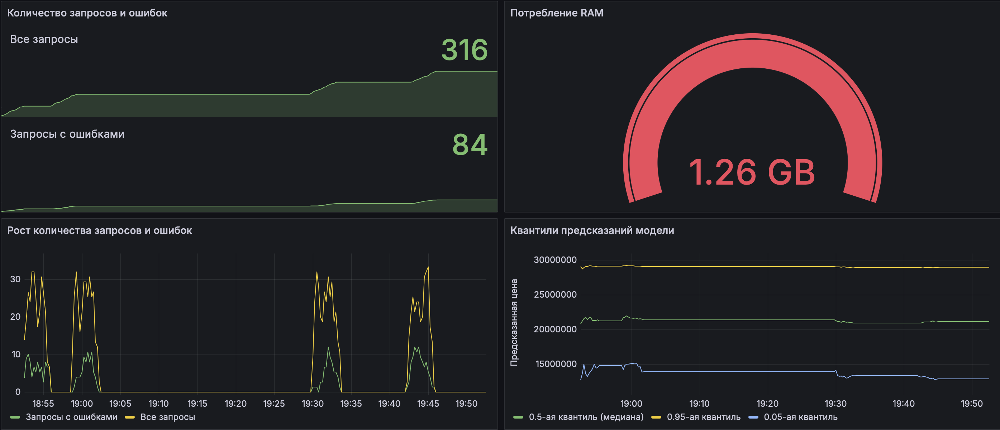

# Мониторинг
### Для мониторинга выбраны следующие метрики:
##### Инфраструткурный слой
- Потребление RAM
##### Прикладной слой 
- Общее количество запросов
- Количество запросов с ошибками
- Рост общего количества запросов
- Рост количества запросов с ошибками
##### Бизнес слой 
- 0.5-ая квантиль (медиана) предсказаний модели
- 0.95-ая квантиль предсказаний модели
- 0.05-ая квантиль предсказаний модели

###### Обоснование выбора метрик
- Если по какой-то причине у сервиса закончится доступная RAM, то сервис обязательно упадет. Поэтому важно отслеживать RAM для любого сервиса. 
- Чтобы отслеживать нагрузку на сервис, нужно всегда следить за количеством запросов и ростом количества запросов. Если по какой-то причине запросы перестанут доходить до сервиса, либо запросов станет слишком много, то эти метрики позволят сразу увидеть это.
- Кроме общего количества запросов полезно также следить за количество запросов с ошибками. Если таких запросов станет больше, чем обычно, значит есть какая-то проблема на стороне сервиса, который отправляет запросы.
- Чтобы быть уверенным, что модель работает адекватно, нужно всегда следить за предсказаниями модели. Для этой цели в задаче регрессии лучше всего подходят квантили предсказаний. Если какая-то квантиль резко изменится, значит что-то в данных значительно изменилось. 

#### Итоговый dashboard

- Для каждой метрики выбран наиболее подходящий тип графика. Для метрик, где важно видеть историю, выбраны графики, где по оси Х отложено время: графики типа Time series и Stat. Для метрики, где нужно знать только текущее значение, выбран график типа Gauge.
- Все графики имеют заголовки, подписи осей и понятные легенды, что упрощает восприятие этих графиков.
- Каждый график отвечает на свой вопрос. Про каждый вопрос подробно написано выше в разделе про "обснование выбора метрик".